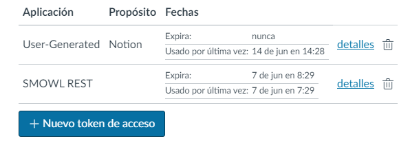

**Para crear un token en canvas -> Profile/Settings**  

  

**Para crear un token en notion -> Settings/Integrations**  
_La integración debe añadirse a la base de datos, dando click en share -> invite_

  

**Referencias**
- [CANVAS lms API](https://canvas.instructure.com/doc/api/)
- [NOTION API](https://developers.notion.com/reference/intro)
